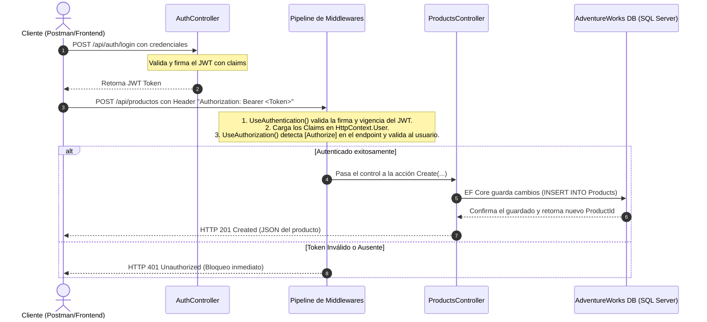

# 4. Atributo `[Authorize]` en ASP.NET Core

El atributo `[Authorize]` es uno de los componentes de seguridad fundamentales en ASP.NET Core. Se utiliza para proteger controladores y métodos de acción, garantizando que solo los usuarios autenticados (y opcionalmente autorizados) puedan acceder a ellos.

---

## 📖 ¿Qué es y para qué sirve?

* **Significado:** Es un atributo de filtrado de autorización (`Microsoft.AspNetCore.Authorization.AuthorizeAttribute`).
* **Propósito:** Restringir el acceso a ciertos endpoints.
* **Control de Acceso:** 
  - **Autenticación Básica:** Asegura que el usuario haya iniciado sesión (posea una identidad válida).
  - **Autorización por Políticas (Policies):** Exige que el usuario cumpla con reglas complejas (ej. tener ciertos claims).
  - **Autorización por Roles:** Exige que el usuario pertenezca a un grupo o rol específico (ej. `[Authorize(Roles = "Admin")]`).

---

## 🛠️ ¿Cómo funciona bajo el capó?

Cuando un cliente hace una solicitud HTTP a un endpoint protegido:

1. **Pipeline de Middlewares:** La petición entra a través de `Program.cs` y pasa por dos middlewares clave:
   - `app.UseAuthentication()`: Lee las credenciales (como el Token JWT en el encabezado `Authorization`) y carga la identidad del usuario en `HttpContext.User`.
   - `app.UseAuthorization()`: Verifica si el endpoint solicitado requiere autorización. Si tiene `[Authorize]`, valida que `HttpContext.User.Identity.IsAuthenticated` sea verdadero.
2. **Evaluación de Políticas:** Si se especifica una política como `[Authorize(Policy = "DeletePermission")]`, comprueba si los *Claims* del usuario coinciden con las reglas configuradas.
3. **Bloqueo / Acceso:**
   - **401 Unauthorized:** Si el usuario no tiene una sesión/token válido.
   - **403 Forbidden:** Si el usuario está autenticado, pero no tiene los permisos suficientes (roles o claims).
   - **200/201/204 Success:** Si el usuario cumple con todo y el flujo continúa al controlador.

---

## 💻 Implementación en el Proyecto

Hemos configurado un ejemplo práctico protegiendo la **creación de productos** en nuestro backend.

### 1. El Controlador Protegido
En [ProductsController.cs](file:///Users/usuario/Desktop/proyecto_activos/test/Backend/Controllers/ProductsController.cs#L140-L142) se decoró el método `Create` con el atributo `[Authorize]`:

```csharp
[HttpPost]
[Authorize] // <-- Requiere estar autenticado para crear un producto
public async Task<IActionResult> Create([FromBody] CreateProductDto productDto)
{
    var (result, createdProduct) = await _productService.CreateAsync(productDto);
    // ...
}
```

### 2. Configuración en [Program.cs](file:///Users/usuario/Desktop/proyecto_activos/test/Backend/Program.cs#L59-L93)
Para que el atributo funcione, el backend debe saber procesar la autenticación (en este caso, tokens JWT) y la autorización:

```csharp
// 1. Registrar el servicio de autenticación JWT
builder.Services.AddAuthentication(JwtBearerDefaults.AuthenticationScheme)
    .AddJwtBearer(options => {
        options.TokenValidationParameters = new TokenValidationParameters {
            ValidateIssuer = true,
            ValidateAudience = true,
            ValidateLifetime = true,
            ValidateIssuerSigningKey = true,
            ValidIssuer = builder.Configuration["Jwt:Issuer"],
            ValidAudience = builder.Configuration["Jwt:Audience"],
            IssuerSigningKey = new SymmetricSecurityKey(
                Encoding.UTF8.GetBytes(builder.Configuration["Jwt:Key"]!))
        };
    });

// 2. Habilitar Middlewares en el ciclo de vida HTTP
app.UseAuthentication(); // <-- Identifica quién es el usuario
app.UseAuthorization();  // <-- Valida qué tiene permitido hacer
```

### 3. Generación del Token en [AuthController.cs](file:///Users/usuario/Desktop/proyecto_activos/test/Backend/Controllers/AuthController.cs#L21-L52)
Cuando un usuario hace login, se genera su JWT con sus Claims:

```csharp
[HttpPost("login")]
public IActionResult Login([FromBody] LoginDto loginDto)
{
    if (loginDto.UserName != "ana" || loginDto.Password != "1234")
    {
        return Unauthorized();
    }

    var claims = new List<Claim>
    {
        new(ClaimTypes.Name, loginDto.UserName),
        new("CanDeleteProducts", loginDto.UserName == "ana" ? "true" : "false")
    };

    // Creación y firma del token...
}
```

---

## 🗄️ Relación con la Base de Datos

Cuando se ejecuta una solicitud de creación autorizada con éxito:
1. El backend valida el token.
2. El `ProductsController` delega al servicio `IProductService`.
3. Entity Framework Core traduce la acción en un comando SQL:
   ```sql
   INSERT INTO [Production].[Product] ([Name], [ProductNumber], [Color], [StandardCost], [ListPrice], ...)
   VALUES (@p0, @p1, @p2, @p3, @p4, ...);
   ```
4. El producto se inserta físicamente en la tabla `Product` de la base de datos `AdventureWorks`.

---

## 🔄 Flujo Detallado de la Petición


