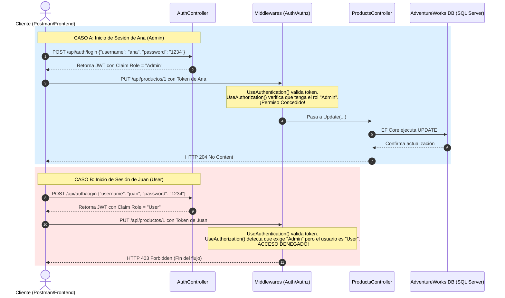

# 45. Roles en ASP.NET Core (RBAC)

El control de acceso basado en roles (**RBAC** - *Role-Based Access Control*) es un método para restringir el acceso a los recursos del sistema en función del grupo o función asignada a cada usuario (ej. *Admin*, *Supervisor*, *User*).

---

## 📖 ¿Qué son los Roles, de dónde vienen y para qué sirven?

* **Significado:** Un Rol representa una categoría, etiqueta o grupo al que pertenece un usuario.
* **Propósito:** Agrupar permisos y simplificar la administración de accesos.

### 🔍 Detalle Técnico y Arquitectura de Roles en .NET

Los Roles en .NET **no provienen de ningún paquete externo** (como NuGet); son una **característica nativa del framework** integrada en las librerías base de seguridad de .NET (`System.Security`). Aquí te explico de dónde vienen técnicamente:

1. **La interfaz `IPrincipal` y `IIdentity`:**
   - Desde las primeras versiones de .NET, la seguridad se basa en dos interfaces del namespace `System.Security.Principal`:
     - `IIdentity`: Representa quién es el usuario (su nombre, tipo de autenticación, etc.).
     - `IPrincipal`: Representa el contexto de seguridad del usuario en la petición actual. Esta interfaz expone de forma obligatoria el método:
       ```csharp
       bool IsInRole(string role);
       ```
2. **La clase `ClaimsPrincipal`:**
   - En las versiones modernas de .NET (incluyendo .NET 10 y ASP.NET Core), la clase concreta que implementa esta seguridad es `ClaimsPrincipal` (del namespace `System.Security.Claims`).
   - Cuando el middleware `UseAuthentication()` valida un JWT, crea una instancia de `ClaimsPrincipal` y la asigna a la propiedad `HttpContext.User`.
3. **¿Cómo se almacena un Rol bajo el capó?**
   - Un Rol no es más que un **Claim** (una declaración clave-valor) de tipo especial.
   - El tipo de claim estándar para roles es `ClaimTypes.Role` (cuyo valor interno de URI es `"http://schemas.microsoft.com/ws/2008/06/identity/claims/role"`).
   - Cuando ejecutas `User.IsInRole("Admin")`, .NET recorre todos los claims de la identidad buscando alguno que coincida con `ClaimTypes.Role` y cuyo valor sea `"Admin"`.
4. **¿Cómo se procesa `[Authorize(Roles = "Admin")]`?**
   - Este atributo le indica a la infraestructura de autorización de ASP.NET Core que genere un requerimiento de rol (`RolesAuthorizationRequirement`).
   - El middleware de autorización evalúa este requerimiento llamando de fondo al método nativo `HttpContext.User.IsInRole("Admin")`.

---

## 🛠️ Implementación en el Proyecto (Ejemplo Completo y Sencillo)

Para demostrar el comportamiento de los Roles de forma práctica, configuramos un escenario con dos usuarios de prueba en el backend:
1. **Ana (`"ana"`)**: Tiene el rol **`Admin`**. Tiene permitido editar productos.
2. **Juan (`"juan"`)**: Tiene el rol **`User`**. Solo puede ver productos, pero tiene **prohibido** editarlos.

### 1. Asignación Dinámica de Roles al Iniciar Sesión
En [AuthController.cs](file:///Users/usuario/Desktop/proyecto_activos/test/Backend/Controllers/AuthController.cs#L22-L35), configuramos que el login acepte a ambos usuarios y asigne el rol correspondiente:

```csharp
[HttpPost("login")]
public IActionResult Login([FromBody] LoginDto loginDto)
{
    // 1. Validamos credenciales para 'ana' y 'juan'
    if ((loginDto.UserName != "ana" && loginDto.UserName != "juan") || loginDto.Password != "1234")
    {
        return Unauthorized();
    }

    // 2. Si es 'ana' es Admin, si es 'juan' es User
    var role = loginDto.UserName == "ana" ? "Admin" : "User";

    var claims = new List<Claim>
    {
        new(ClaimTypes.Name, loginDto.UserName),
        new(ClaimTypes.Role, role), // <-- Se incrusta dinámicamente "Admin" o "User"
        new("CanDeleteProducts", loginDto.UserName == "ana" ? "true" : "false")
    };
    // ... generación del JWT
}
```

### 2. Restricción del Endpoint en el Controlador
En [ProductsController.cs](file:///Users/usuario/Desktop/proyecto_activos/test/Backend/Controllers/ProductsController.cs#L156-L159), aplicamos la restricción de rol en el método de actualización (`Update`):

```csharp
[HttpPut("{id:int}")]
[Authorize(Roles = "Admin")] // <-- Solo los usuarios con el rol "Admin" (Ana) pueden editar productos
public async Task<IActionResult> Update(int id, [FromBody] UpdateProductDto productDto)
{
    // ... lógica de actualización con Entity Framework Core
}
```

---

## 🗄️ Relación con la Base de Datos

Cuando la petición pasa exitosamente la autorización (es decir, el usuario es **Ana** con rol `Admin`):
1. El controlador ejecuta `_productService.UpdateAsync(id, productDto)`.
2. Entity Framework Core traduce la acción y realiza una actualización física en la tabla `Product` de la base de datos `AdventureWorks`:
   ```sql
   UPDATE [Production].[Product]
   SET [Name] = @p0, [ProductNumber] = @p1, ...
   WHERE [ProductID] = @p2;
   ```
*(Si es **Juan** con rol `User`, la base de datos nunca recibe ninguna consulta porque la petición es bloqueada antes de llegar al controlador).*

---

## 🔄 Flujo Completo de la Petición

A continuación se detalla cómo responde el servidor según el usuario que intenta actualizar un producto:



---

## 🔍 Explicación Línea por Línea del Código Clave

#### En [AuthController.cs](file:///Users/usuario/Desktop/proyecto_activos/test/Backend/Controllers/AuthController.cs):
* `if ((loginDto.UserName != "ana" && loginDto.UserName != "juan") || loginDto.Password != "1234")`: Si el usuario no es ninguno de los dos permitidos o la contraseña no es `"1234"`, la petición es denegada con un código `401 Unauthorized`.
* `var role = loginDto.UserName == "ana" ? "Admin" : "User"`: Determina el rol de forma dinámica. Si el login es de `"ana"`, el valor es `"Admin"`; de lo contrario, al ser `"juan"`, es `"User"`.
* `new(ClaimTypes.Role, role)`: Crea la afirmación (Claim) del rol y la incrusta dentro del token JWT para que persista durante la sesión del usuario.

#### En [ProductsController.cs](file:///Users/usuario/Desktop/proyecto_activos/test/Backend/Controllers/ProductsController.cs):
* `[Authorize(Roles = "Admin")]`: Indica al middleware de autorización que verifique si la identidad decodificada del JWT contiene la afirmación de Rol con el valor de `"Admin"`. Si contiene `"User"` (como en el caso de Juan), corta la petición inmediatamente y devuelve `403 Forbidden`.
