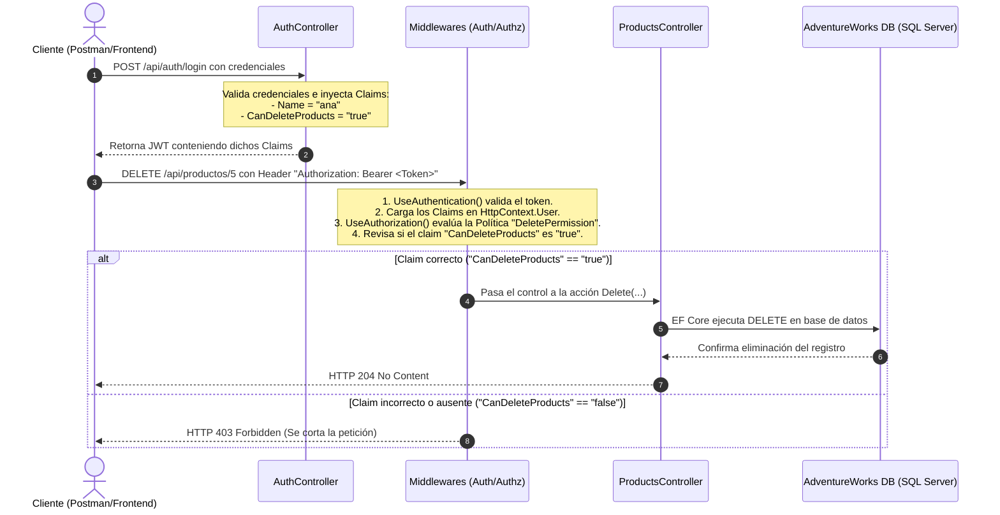

# 46. Claims en ASP.NET Core

Los **Claims** (afirmaciones o declaraciones) son la base de la identidad y seguridad moderna en .NET y en los estándares de autenticación web (como tokens JWT).

---

## 📖 ¿Qué son los Claims, de dónde vienen y para qué sirven?

* **Significado:** Un Claim es una declaración clave-valor que un emisor afirma sobre un usuario.
* **Propósito:** Ofrecer un control de acceso mucho más específico (CBAC - *Claims-Based Access Control*) que los roles tradicionales.

### 🔍 Detalle Técnico y Arquitectura de Claims en .NET

Al igual que los roles, los Claims **no requieren ningún paquete externo** (como NuGet). Son parte de la infraestructura de seguridad básica de .NET:

1. **La clase `Claim` (`System.Security.Claims`):**
   - Es una clase física dentro de la librería base de .NET. Representa la información individual. Sus propiedades clave son:
     - `Type` (string): El tipo de claim, normalmente especificado como un URI (ej. `http://schemas.xmlsoap.org/ws/2005/05/identity/claims/name`).
     - `Value` (string): El valor asignado (ej. `"ana"`).
2. **La clase `ClaimsIdentity`:**
   - Representa un conjunto de claims que forman una identidad única (como la cédula de identidad). Un usuario puede tener múltiples identidades (ej. una identidad local y otra de Google).
3. **La clase `ClaimsPrincipal`:**
   - Es el contenedor principal (`HttpContext.User`) que puede albergar múltiples objetos `ClaimsIdentity`.
4. **Validación dinámica (Politicas de Autorización):**
   - Cuando usas una política como `policy.RequireClaim("CanDeleteProducts", "true")`, ASP.NET Core ejecuta un handler (`ClaimsAuthorizationHandler`) que busca dentro del `ClaimsPrincipal` si existe algún objeto `Claim` cuyo tipo sea `"CanDeleteProducts"` y su valor coincida con `"true"`.

---

## 🛠️ Implementación en el Proyecto

El backend ya cuenta con Claims personalizados para controlar la eliminación física de registros.

### 1. Creación del Claim en el Token
Cuando el usuario inicia sesión en [AuthController.cs](file:///Users/usuario/Desktop/proyecto_activos/test/Backend/Controllers/AuthController.cs#L31-L36), el servidor añade los Claims al token que le devuelve al cliente:

```csharp
var claims = new List<Claim>
{
    new(ClaimTypes.Name, loginDto.UserName), // Claim estándar: Nombre
    new(ClaimTypes.Role, role),              // Claim estándar: Rol
    new("CanDeleteProducts", loginDto.UserName == "ana" ? "true" : "false") // Claim personalizado
};
```

### 2. Configuración de la Política en [Program.cs](file:///Users/usuario/Desktop/proyecto_activos/test/Backend/Program.cs#L75-L79)
El servidor lee y procesa los claims configurando una **Política** que exige la presencia de un claim específico:

```csharp
builder.Services.AddAuthorization(options =>
{
    options.AddPolicy("DeletePermission", policy => 
        policy.RequireClaim("CanDeleteProducts", "true")); // <-- Exige que el Claim "CanDeleteProducts" tenga el valor "true"
});
```

### 3. Protección del Endpoint en [ProductsController.cs](file:///Users/usuario/Desktop/proyecto_activos/test/Backend/Controllers/ProductsController.cs#L202-L204)
El método de eliminación requiere que se cumpla la política:

```csharp
[HttpDelete("{id:int}")]
[Authorize(Policy = "DeletePermission")] // <-- Evalúa la política de Claims
public async Task<IActionResult> Delete(int id)
{
    // ...
}
```

---

## 🗄️ Relación con la Base de Datos

Cuando un usuario con el claim `"CanDeleteProducts" = "true"` hace la petición:
1. El middleware de autorización valida que el claim exista en su JWT y sea `"true"`.
2. Se ejecuta el controlador, el cual llama a `_productService.DeleteAsync(id)`.
3. Entity Framework Core ejecuta un comando de eliminación en la tabla `Product` de la base de datos `AdventureWorks`:
   ```sql
   DELETE FROM [Production].[Product]
   WHERE [ProductID] = @p0;
   ```

---

## 🔄 Flujo Detallado de la Petición



---

## 🔍 Explicación Línea por Línea del Código Clave

#### En [AuthController.cs](file:///Users/usuario/Desktop/proyecto_activos/test/Backend/Controllers/AuthController.cs):
* `new(ClaimTypes.Name, loginDto.UserName)`: Crea una afirmación estándar para almacenar el nombre único del usuario actual.
* `new("CanDeleteProducts", loginDto.UserName == "ana" ? "true" : "false")`: Crea un Claim totalmente personalizado. Evalúa si el usuario es `"ana"`. De ser así, le asigna el valor `"true"`, lo que le otorgará permiso de eliminación en el backend.

#### En [Program.cs](file:///Users/usuario/Desktop/proyecto_activos/test/Backend/Program.cs):
* `options.AddPolicy("DeletePermission", ...)`: Define una regla de acceso (Política) llamada `"DeletePermission"`.
* `policy.RequireClaim("CanDeleteProducts", "true")`: Configura la política de tal forma que cualquier endpoint que la use exigirá que el token JWT del usuario contenga el Claim `"CanDeleteProducts"` con el valor de `"true"`.

#### En [ProductsController.cs](file:///Users/usuario/Desktop/proyecto_activos/test/Backend/Controllers/ProductsController.cs):
* `[Authorize(Policy = "DeletePermission")]`: Vincula el endpoint `Delete` con la política registrada en `Program.cs`. Si el usuario no tiene la afirmación requerida en su token, el pipeline se corta antes de tocar la base de datos y retorna un error `403 Forbidden`.
