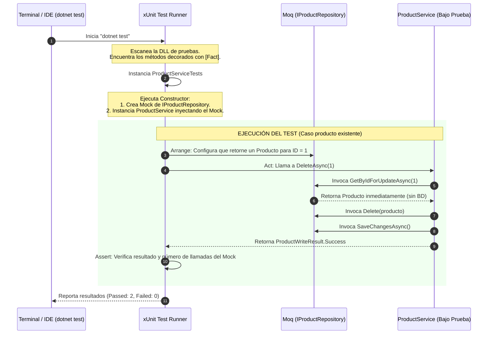

# 47. Unit Testing (Pruebas Unitarias) en .NET

Las **Pruebas Unitarias** son un mecanismo automatizado para verificar que los componentes individuales de software (normalmente clases y sus métodos) funcionen correctamente de forma aislada.

---

## 📖 ¿Qué es el Unit Testing y para qué sirve?

* **Naturaleza del punto:** Es una **metodología de desarrollo** (práctica de ingeniería de software). 
* **¿Es un paquete o librería?** Sí. En este ejemplo práctico utilizamos e importamos directamente dos paquetes externos: **xUnit** y **Moq**.

### 📦 Paquetes Utilizados en este Ejemplo y Cómo se Instalaron

En el código de nuestra prueba de ejemplo ([ProductServiceTests.cs](file:///Users/usuario/Desktop/proyecto_activos/test/Backend.Tests/ProductServiceTests.cs)) se utilizaron específicamente:
1. **`xunit`** (Framework de pruebas: necesario para usar `[Fact]` y `Assert.Equal`).
2. **`Moq`** (Librería de simulación: necesaria para usar `Mock<T>`).

**¿Cómo se instalaron?**
Como el proyecto de pruebas `Backend.Tests` ya estaba creado, estos dos paquetes **ya venían pre-instalados en sus dependencias**, por lo que **no fue necesario que corriéramos ningún comando de instalación manual**.

*Nota: Si estuvieras creando este proyecto de pruebas desde cero, los instalarías ejecutando estos comandos en tu terminal:*
```bash
dotnet add package xunit
dotnet add package Moq
```
* **Propósito:** 
  - Asegurar que la lógica de negocio de una clase sea correcta.
  - Prevenir "regresiones" (romper código viejo al añadir código nuevo).
  - Actuar como documentación viva de cómo debe comportarse el sistema.
* **El Principio del Aislamiento:** En una prueba unitaria pura **no se toca la base de datos real, ni archivos del sistema, ni APIs externas**. Todo lo externo se reemplaza por un **Mock** (objeto simulado).

---

## 🛠️ Implementación en el Proyecto

Hemos creado el archivo [ProductServiceTests.cs](file:///Users/usuario/Desktop/proyecto_activos/test/Backend.Tests/ProductServiceTests.cs) dentro del proyecto de pruebas del backend. En este ejemplo, probamos el método `DeleteAsync` de la clase `ProductService`.

> [!IMPORTANT]
> **Paquetes utilizados en este código:**
> En este archivo de pruebas estamos importando y utilizando específicamente dos paquetes externos:
> 1. **`xUnit`** (a través de `using Xunit;`): Usamos el atributo `[Fact]` para que .NET sepa que es un método de prueba, y la clase estática `Assert` para hacer las verificaciones.
> 2. **`Moq`** (a través de `using Moq;`): Usamos la clase `Mock<T>` para simular la interfaz del repositorio, y sus métodos `.Setup()`, `.ReturnsAsync()` y `.Verify()` para programar y comprobar su comportamiento.

### Código del Test: [ProductServiceTests.cs](file:///Users/usuario/Desktop/proyecto_activos/test/Backend.Tests/ProductServiceTests.cs)
```csharp
using Backend.Dtos;
using Backend.Models;
using Backend.Repositories;
using Backend.Services;
using Moq;
using Xunit;

namespace Backend.Tests;

public class ProductServiceTests
{
    private readonly Mock<IProductRepository> _productRepositoryMock;
    private readonly ProductService _productService;

    public ProductServiceTests()
    {
        // 1. Inicializamos el Mock (Simulador) del repositorio
        _productRepositoryMock = new Mock<IProductRepository>();
        
        // 2. Inyectamos el objeto simulado al constructor del servicio
        _productService = new ProductService(_productRepositoryMock.Object);
    }

    [Fact] // <-- Indica que este es un método de prueba para xUnit
    public async Task DeleteAsync_WhenProductDoesNotExist_ReturnsNotFound()
    {
        // Arrange (Preparación)
        int productId = 99;
        _productRepositoryMock
            .Setup(repo => repo.GetByIdForUpdateAsync(productId))
            .ReturnsAsync((Product?)null); // Si preguntan por ID 99, devuelve NULL (no existe)

        // Act (Acción)
        var result = await _productService.DeleteAsync(productId);

        // Assert (Verificación)
        Assert.Equal(ProductWriteResult.NotFound, result);
        
        // Verificamos que NUNCA se llamaran a los métodos que modifican la BD
        _productRepositoryMock.Verify(repo => repo.Delete(It.IsAny<Product>()), Times.Never);
        _productRepositoryMock.Verify(repo => repo.SaveChangesAsync(), Times.Never);
    }

    [Fact]
    public async Task DeleteAsync_WhenProductExists_DeletesProductAndReturnsSuccess()
    {
        // Arrange (Preparación)
        int productId = 1;
        var product = new Product { ProductId = productId, Name = "Test Product", ProductNumber = "TEST-001" };
        
        _productRepositoryMock
            .Setup(repo => repo.GetByIdForUpdateAsync(productId))
            .ReturnsAsync(product); // Si preguntan por ID 1, devuelve el producto simulado

        // Act (Acción)
        var result = await _productService.DeleteAsync(productId);

        // Assert (Verificación)
        Assert.Equal(ProductWriteResult.Success, result);
        
        // Verificamos que se borrara y guardara en BD exactamente una vez
        _productRepositoryMock.Verify(repo => repo.Delete(product), Times.Once);
        _productRepositoryMock.Verify(repo => repo.SaveChangesAsync(), Times.Once);
    }
}
```

---

## 🗄️ Relación con la Base de Datos

En las pruebas unitarias, **no hay interacción con SQL Server**.
* La llamada a la base de datos a través de EF Core está encapsulada en la interfaz `IProductRepository`.
* En la prueba, reemplazamos `IProductRepository` con un Mock.
* Cuando el código ejecuta `_productRepository.GetByIdForUpdateAsync(id)`, no va a SQL Server; en su lugar, el Mock responde inmediatamente con el valor que programamos en el **Arrange** (`ReturnsAsync`).
* Esto permite que las pruebas se ejecuten en milisegundos y no dependan de si el servidor de base de datos está encendido o apagado.

---

## 🔄 Flujo Detallado de Ejecución de la Prueba

El proceso de cómo se ejecuta y valida una prueba unitaria sigue este flujo:



---

## 🔍 Explicación Línea por Línea del Código Clave

#### En [ProductServiceTests.cs](file:///Users/usuario/Desktop/proyecto_activos/test/Backend.Tests/ProductServiceTests.cs):
* `private readonly Mock<IProductRepository> _productRepositoryMock;`: Declaración del simulador de la base de datos utilizando la librería Moq.
* `_productService = new ProductService(_productRepositoryMock.Object);`: Pasamos el objeto simulado (`.Object`) al constructor de la clase que queremos probar. Esta técnica se conoce como **Inyección de Dependencias**.
* `[Fact]`: Atributo nativo de xUnit que le indica al motor de pruebas que este método específico debe ejecutarse como un caso de prueba.
* `_productRepositoryMock.Setup(...)`: Configura el comportamiento que tomará el repositorio simulado al recibir llamadas a métodos específicos.
* `ReturnsAsync(...)`: Configura qué objeto o valor simulado retornará inmediatamente el método asíncrono configurado en el `Setup`.
* `Assert.Equal(ProductWriteResult.NotFound, result)`: Compara el resultado devuelto por la lógica con el valor que teóricamente esperamos que retorne. Si difieren, la prueba falla.
* `_productRepositoryMock.Verify(..., Times.Never)`: Comprueba que durante la ejecución de la lógica, no se haya invocado a ese método específico del repositorio (por ejemplo, para asegurarnos de que si un producto no existe, no se intente eliminar nada).
* `_productRepositoryMock.Verify(..., Times.Once)`: Comprueba que el método del repositorio se haya ejecutado exactamente una vez.
