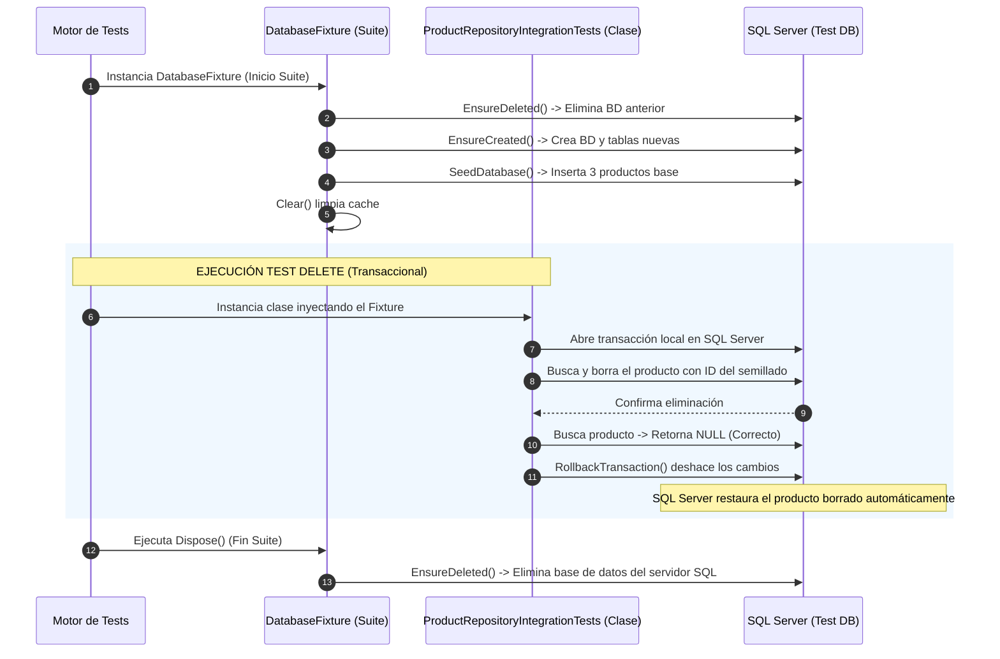

# 48. Integration Testing (Pruebas de Integración) en SQL Server

Las **Pruebas de Integración** verifican que múltiples componentes de tu aplicación (como tu código C#, Entity Framework Core, traductores de consulta y la base de datos) funcionen correctamente trabajando en conjunto.

---

## 📖 Conceptos Clave de las Pruebas de Integración con Buenas Prácticas

Al diseñar pruebas de integración profesionales en .NET, no solo nos conectamos a la base de datos, sino que estructuramos los tests usando patrones de arquitectura avanzados para garantizar velocidad, portabilidad y limpieza:

### 1. Base de Datos de Pruebas Dedicada (Test Database)
* **¿Qué es?** Es una base de datos física secundaria creada exclusivamente para pruebas (ej. `AdventureWorks2025_Test`), completamente separada de tu base de datos de desarrollo.
* **¿Para qué sirve?** Evita cualquier conflicto de bloqueo de tablas, saltos de IDs autoincrementales (`IDENTITY`) o sobreescritura accidental de datos reales del desarrollador.

### 2. Compartir Recursos Eficientemente (xUnit Class Fixtures)
* **¿Qué es?** Es el patrón de diseño recomendado en xUnit (`IClassFixture<T>`). Permite encapsular la configuración pesada (como crear y eliminar bases de datos físicas en SQL Server) en una clase externa llamada **Fixture** que se ejecuta **una sola vez** por grupo de pruebas.
* **¿Para qué sirve?** Si creáramos y borráramos la base de datos en SQL Server en cada test individual, correr 100 pruebas tomaría minutos. Con `IClassFixture`, la base de datos se crea, se semilla una vez, todos los tests la usan de forma compartida, y al finalizar se elimina. Esto acelera las pruebas radicalmente.

### 3. Aislamiento entre Pruebas (Test Isolation)
* **¿Qué es?** Es la garantía de que una prueba no afecte el resultado de otra cuando comparten la misma base de datos.
* **¿Para qué sirve?** Si un test elimina el producto "Mouse Inalámbrico", la siguiente prueba que busque todos los productos fallaría porque falta un elemento.
* **Solución:** Cada test que modifica datos inicia una **transacción local** y ejecuta un **`Rollback`** al finalizar. De este modo, los cambios se descartan inmediatamente y el "Mouse" sigue existiendo para el siguiente test.

### 4. Semillado Centralizado (Seeding)
* **¿Qué es?** El proceso de insertar datos semilla base. Al centralizarlo dentro del Fixture, todas las pruebas tienen acceso a los mismos registros de pruebas conocidos sin duplicar código de inserción.

### 5. Limpieza del Rastreador (Change Tracker Clear)
* **¿Qué es?** Entity Framework Core guarda en memoria caché (Change Tracker) los objetos leídos. 
* **¿Para qué sirve?** Al limpiar el rastreador (`ChangeTracker.Clear()`), obligamos a EF Core a consultar físicamente al servidor SQL Server en cada prueba, probando la integración real y la traducción de consultas SQL, no la caché de memoria en C#.

---

## 🛠️ Implementación de Buenas Prácticas en el Proyecto

Hemos separado el ciclo de vida de la base de datos y el semillado en una clase **Fixture** reutilizable, y configuramos las pruebas para usarla.

### 1. La Clase de Configuración Compartida: [DatabaseFixture.cs](file:///Users/usuario/Desktop/proyecto_activos/test/Backend.Tests/DatabaseFixture.cs)
Esta clase se encarga de crear la base de datos, semillarla y eliminarla una sola vez al terminar todos los tests:

```csharp
using Backend.Data;
using Backend.Models;
using Microsoft.Data.SqlClient;
using Microsoft.EntityFrameworkCore;
using Microsoft.Extensions.Configuration;

namespace Backend.Tests;

public class DatabaseFixture : IDisposable
{
    public AdventureWorksContext Context { get; }

    public DatabaseFixture()
    {
        // 1. Cargamos configuración leyendo los User Secrets del backend dinámicamente
        var configuration = new ConfigurationBuilder()
            .AddUserSecrets(typeof(AdventureWorksContext).Assembly)
            .Build();

        var connectionString = configuration.GetConnectionString("AdventureWorks");

        // 2. Apuntamos a la base de datos de pruebas dedicada
        var connectionStringBuilder = new SqlConnectionStringBuilder(connectionString)
        {
            InitialCatalog = "AdventureWorks2025_Test"
        };

        var options = new DbContextOptionsBuilder<AdventureWorksContext>()
            .UseSqlServer(connectionStringBuilder.ConnectionString)
            .Options;

        Context = new AdventureWorksContext(options);

        // 3. Recreamos la BD solo UNA vez al inicio de la suite
        Context.Database.EnsureDeleted();
        Context.Database.EnsureCreated();

        // 4. Semillamos los datos base
        SeedDatabase();
    }

    private void SeedDatabase()
    {
        var products = new List<Product>
        {
            new() { Name = "Laptop Gamer", ProductNumber = "LPT-001", SafetyStockLevel = 10, ReorderPoint = 5, StandardCost = 500m, ListPrice = 800m, SellStartDate = DateTime.UtcNow, ModifiedDate = DateTime.UtcNow },
            new() { Name = "Mouse Inalambrico", ProductNumber = "MS-002", SafetyStockLevel = 50, ReorderPoint = 20, StandardCost = 10m, ListPrice = 20m, SellStartDate = DateTime.UtcNow, ModifiedDate = DateTime.UtcNow },
            new() { Name = "Teclado Mecanico", ProductNumber = "KB-003", SafetyStockLevel = 30, ReorderPoint = 15, StandardCost = 30m, ListPrice = 50m, SellStartDate = DateTime.UtcNow, ModifiedDate = DateTime.UtcNow }
        };

        Context.Products.AddRange(products);
        Context.SaveChanges();
        Context.ChangeTracker.Clear();
    }

    public void Dispose()
    {
        // Al terminar todas las pruebas, borramos la BD de SQL Server
        Context.Database.EnsureDeleted();
        Context.Dispose();
    }
}
```

### 2. La Clase de Pruebas: [ProductRepositoryIntegrationTests.cs](file:///Users/usuario/Desktop/proyecto_activos/test/Backend.Tests/ProductRepositoryIntegrationTests.cs)
La clase implementa `IClassFixture<DatabaseFixture>`. Recibe el contexto ya inicializado por el constructor y corre los tests aislando las modificaciones con transacciones y rollbacks:

```csharp
using Backend.Data;
using Backend.Models;
using Backend.Repositories;
using Microsoft.EntityFrameworkCore;
using Xunit;

namespace Backend.Tests;

public class ProductRepositoryIntegrationTests : IClassFixture<DatabaseFixture>
{
    private readonly AdventureWorksContext _context;
    private readonly ProductRepository _repository;

    public ProductRepositoryIntegrationTests(DatabaseFixture fixture)
    {
        // xUnit nos inyecta automáticamente la instancia única del Fixture
        _context = fixture.Context;
        _repository = new ProductRepository(_context);
    }

    [Fact]
    public async Task GetAllAsync_ReturnsSeededProductsOrderedByName()
    {
        // Act - Consultamos la base de datos real SQL Server de pruebas
        var products = await _repository.GetAllAsync();

        // Assert - Verificamos que traiga exactamente los 3 productos ordenados alfabéticamente
        Assert.NotNull(products);
        Assert.Equal(3, products.Count);
        Assert.Equal("Laptop Gamer", products[0].Name);      // L
        Assert.Equal("Mouse Inalambrico", products[1].Name);  // M
        Assert.Equal("Teclado Mecanico", products[2].Name);   // T
    }

    [Fact]
    public async Task Delete_WhenProductExists_RemovesProductFromDatabase()
    {
        // 1. Iniciamos una transacción local en la base de datos compartida
        await using var transaction = await _context.Database.BeginTransactionAsync();

        try
        {
            // 2. Buscamos el "Mouse Inalámbrico" de los datos semillados por el Fixture
            var products = await _repository.GetAllAsync();
            var mouse = products.FirstOrDefault(p => p.ProductNumber == "MS-002");
            Assert.NotNull(mouse);

            // 3. Act - Eliminamos el producto
            _repository.Delete(mouse);
            await _repository.SaveChangesAsync();

            // 4. Assert - Comprobamos que al buscarlo por su ID ya no exista
            var deletedProduct = await _repository.GetByIdAsync(mouse.ProductId);
            Assert.Null(deletedProduct);

            // 5. Assert - Comprobamos que la lista se redujo a 2 productos
            var remainingProducts = await _repository.GetAllAsync();
            Assert.Equal(2, remainingProducts.Count);
        }
        finally
        {
            // 6. Rollback obligatorio: Revertimos la eliminación del Mouse para que
            // los datos sigan completos para el resto de pruebas de la clase.
            await transaction.RollbackAsync();
            _context.ChangeTracker.Clear();
        }
    }
}
```

---

## 🗄️ Relación con la Base de Datos

En este flujo:
* SQL Server hospeda físicamente `AdventureWorks2025_Test`.
* Al ejecutar `dotnet test`, el servidor recibe la orden de creación de tablas una sola vez.
* Al ejecutar el test `Delete`, SQL Server procesa la eliminación física pero la mantiene en un estado temporal.
* Al llamar a `RollbackAsync()`, el motor de base de datos descarta los cambios en el archivo de logs físicos, asegurando que el registro borrado vuelva a aparecer inmediatamente.

---

## 🔄 Flujo Detallado de la Petición

El ciclo de vida con Fixtures se describe así:



---

## 🔍 Explicación Línea por Línea del Código Clave

* `public class ProductRepositoryIntegrationTests : IClassFixture<DatabaseFixture>`: Indica a xUnit que esta clase de pruebas comparte el ciclo de vida del recurso `DatabaseFixture`. xUnit ejecutará el constructor del Fixture una sola vez para toda la clase.
* `Context.Database.EnsureDeleted();` y `EnsureCreated();` (en `DatabaseFixture`): Borran y recrean la base de datos de pruebas al iniciar el suite para asegurar que esté en un estado virgen.
* `_context = fixture.Context;` (en el constructor del test): Captura la conexión ya creada y compartida.
* `await using var transaction = await _context.Database.BeginTransactionAsync();`: Abre una transacción a nivel de SQL Server para que todas las operaciones de este método específico sean temporales y aisladas de otras pruebas.
* `await transaction.RollbackAsync();` (en el `finally`): Al concluir la prueba (haya fallado o pasado), revierte todo a su estado original para que el semillado de datos compartidos siga completo para las demás pruebas.
